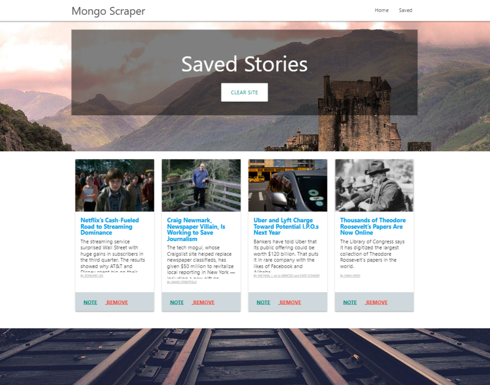
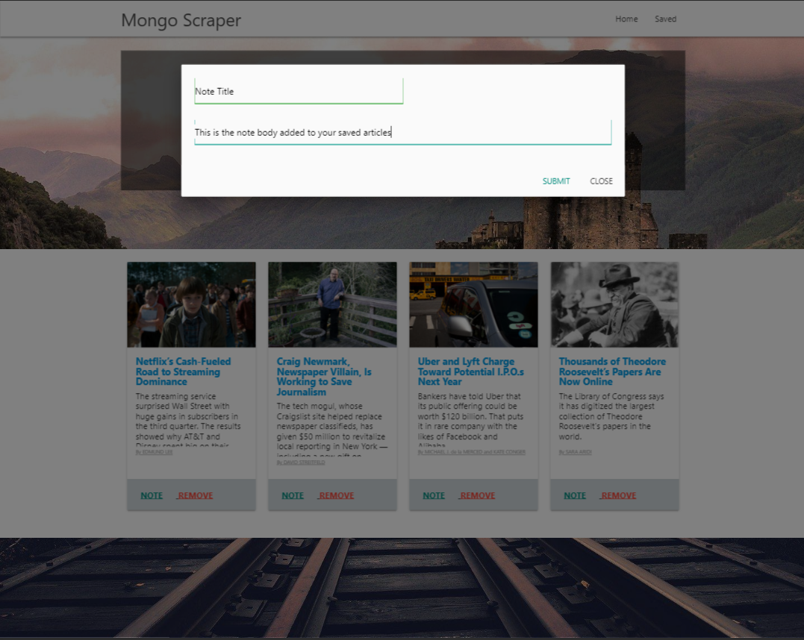

# mongoscraper

_All the News That's Fit to Scrape_

## Preview:

## What was created:

* Create an app that accomplishes the following:

  1. Whenever a user visits your site, the app should scrape stories from a news outlet of your choice and display them for the user. Each scraped article should be saved to your application database. At a minimum, the app should scrape and display the following information for each article:

     * Headline - the title of the article

     * Summary - a short summary of the article

     * URL - the url to the original article

     * Feel free to add more content to your database (photos, bylines, and so on).

  2. Users should also be able to leave comments on the articles displayed and revisit them later. The comments should be saved to the database as well and associated with their articles. Users should also be able to delete comments left on articles. All stored comments should be visible to every user.

* Beyond these requirements, be creative and have fun with this!

